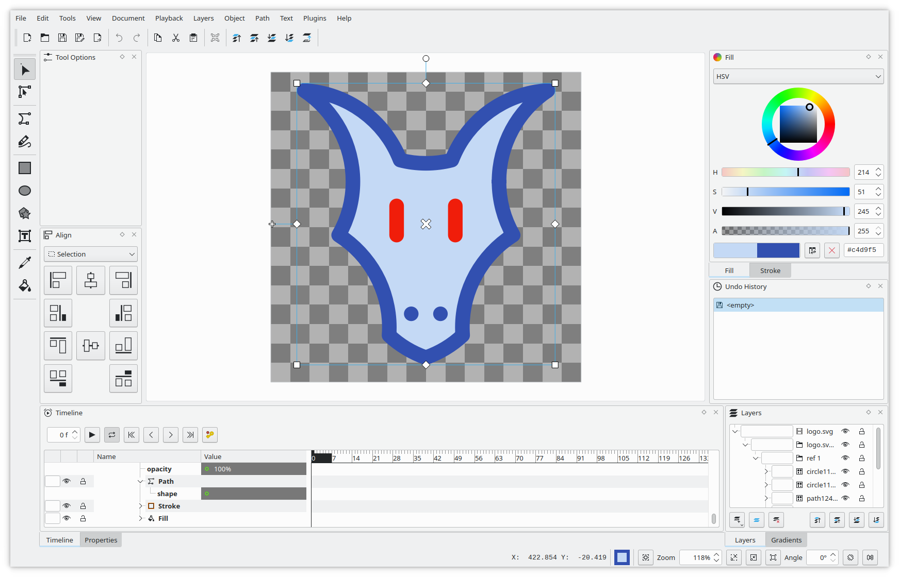
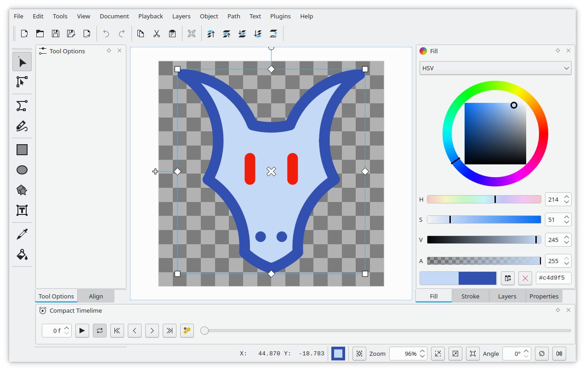

Authors: Mattia Basaglia

# Glaxnimate 0.5.2

Glaxnimate is proud to announce the release of version 0.5.2.
This latest update brings several exciting new features and improvements to enhance your animation creation experience.

## Animation along Path

{lottie:./orbit.json:512:512:orbit.rawr}
*Earth and Moon graphics are from Noto Emoji*

One of the major additions in this release is the ability to animate objects along a path.
This is a feature that allows you to animate elements in a more natural
and organic way by having them move along a custom path instead of a straight line.
With this feature in Glaxnimate, you can create animations of objects following a curved path,
like a bouncing ball or a spaceship flying through space.

After you add position keyframes to an object, the path can be adjusted wih the edit tool,
giving you full control over the motion of your elements,
and the ability to fine-tune your animations until they look just right.

## Improved User Interface

*Compact view*

The interface layout has also been updated with new presets to provide better display on smaller screens,
and the ability to set custom shortcut settings for plugins has been added.

## Enhanced Input/Output Functionality

To make your workflow even easier, a new export option as an image sequence has been added to the menu.

This release also brings support for loading and saving Rive animations,
improving the quality of video exports,
and adding command line options for rendering images without starting the GUI.

Issues with loading Glaxnimate and old Lotties files have also been resolved, as well as a crash on SVG export.

## Scripting Additions

For developers and advanced users, the new release features a function to render a node at a specific frame, providing even more control over your animations.

## Bug Fixes and Minor Enhancements

This release also includes several bug fixes,
including resolution of issues with loading Lotties with hidden fill and stroke,
improved previews in the stroke style view,
and proper application of duration changes in the startup dialog to all layers.

Additionally, Glaxnimate 0.5.2 includes the addition of Flatpack,
improved Freedesktop file naming and metainfo, and the ability to view contributors.
Messages are also logged to a file for better tracking of errors and issues.

The Select tool has also been improved, allowing for better handling of ungrouped shapes,
making your editing process smoother and more efficient.

## Download

We are confident that these new features and improvements
will enhance your experience with Glaxnimate and look forward to
continuing to bring you the best vector animation application.

If you're interested in trying it out, head over to our
[download page](https://glaxnimate.mattbas.org/download/) to get started.
As always, if you have any questions or feedback, feel free to reach out
to us via our [issue tracker](https://gitlab.com/mattbas/glaxnimate/-/issues).

Thank you for your continued support of Glaxnimate!
