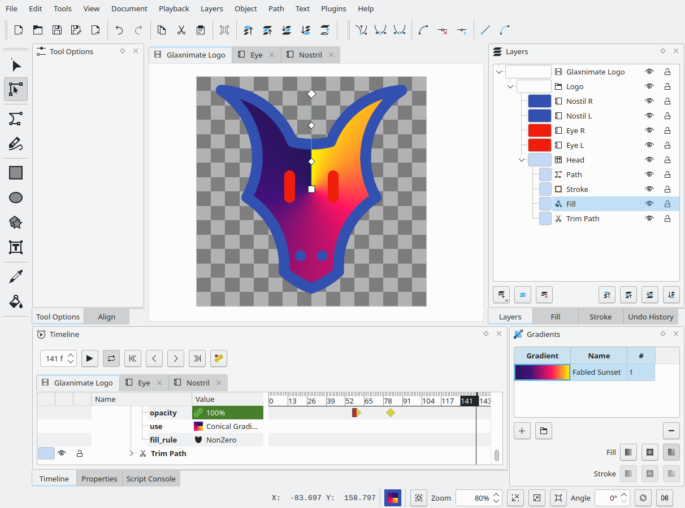

Authors: Mattia Basaglia
description: Glaxnimate 0.5.3
photo: gradient.png

# Glaxnimate 0.5.2

We're excited to announce the release of Glaxnimate 0.5.3! This update
includes a number of new features, bug fixes, and improvements to the user experience.

## Editing

Glaxnimate 0.5.3 introduces several new editing features:

There's a new keyframe preset called "Fast" that basically has the reverse
effect of "Ease".

Additionally, this release adds support for conical gradients.

Users can now select the first Bezier node from the node's context menu.

Version 0.5.2 introduced the ability to animate along a path, 0.5.3 makes
this easier as now there's a new context menu entry for position properties
showing a dialog to select a shape to follow.

## User experience

In addition to editing improvements, Glaxnimate 0.5.3 includes several UI enhancements.
We've made color values in tree views more visually appealing, and removed extra items from the "Move To" dialog.

Changing fill, stroke, and gradient properties now applies to the whole
selection rather than the last selected object.

We've also revamped the context menu for properties, making them consistent
between the timeline and the canvas.

Editing tools are more forgiving now when you release modifier keys before finishing the shape.

Users can now choose whether the timeline scrolls vertically or horizontally without modifiers, and we've added new layout presets to better accommodate a variety of screen sizes.

## File Formats

This release also includes updates to Glaxnimate's import and export functionality.

The main new feature here is the ability to import and export Android Vector Drawables,
the animation format used when making animated icons for Android.

We've also fixed various issues with the SVG parser, improving support for animated paths.

Opening raster images now uses the file basename as layer name, and we've resolved a bug affecting plugin export.

## Bug Fixes

Finally, Glaxnimate 0.5.3 includes a number of bug fixes. We've addressed an issue with layers created by drawing tools not having an end frame, and fixed several other small bugs affecting the user experience.

We encourage all users to upgrade to Glaxnimate 0.5.3 to take advantage of these new features and improvements.
You can download the latest version of Glaxnimate from the [download page](https://glaxnimate.mattbas.org/download/).
