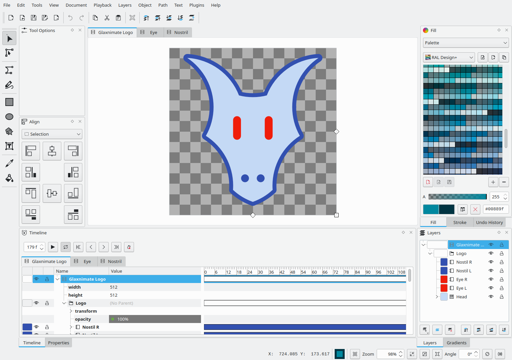
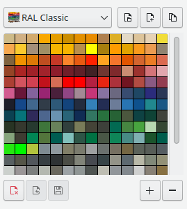

Authors: Mattia Basaglia
description: Glaxnimate 0.5.4
photo: window.png

# Glaxnimate 0.5.4

This release introduces a wide variety of new features and several fixes.

## New Animation Features

{lottie:./overshoot.json:512:188:overshoot.rawr}

One new feature is the overshoot keyframe preset, with this comes the
ability to edit the keyframe transition to go beyond the previously
imposed limits.

{lottie:./auto-orient.json:512:512:auto-orient.rawr}

Added support for "auto orienting" groups and layer, automatically aligning
their rotation with the motion path.

## Composition Overhaul

This is a major change of how compositions are handled internally,
all compositions now share the same attributes and features, without
having a "main" composition that dictates how other compositions should behave.

This fixes several minor inconsistencies that were previously caused by this distinction.

Additionally, when saving formats that support a single composition,
Glaxnimate will automatically export the active composition,
simplifying the exporting process and enhancing overall project management.

## File Formats

The main new feature is support for Adobe After Effects Project files (.aep).
This allows you to open animations created in AE directly within Glaxnimate.

While not all AE features are supported, most animations should work fine.

There have been several improvements to other file formats as well.

### SVG

Now importing a non-animated SVG uses the same duration as the current
composition, making it easier to use SVG files as assets.

Support has been added for importing SVG with animated path shapes,
as well ass `animateMotion`.

Animations within `<defs>` now are imported correctly.

Some other import improvements include fixes to group opacity,
clip paths, anchor point detection, and detection of the start and end
frames (The latter fix also applies to AVD import).

Exporting to SVG has received numerous improvements such as
better star shape conversion, miter limit being correctly exported,
removing unnecessary stroke shapes, and fixing export of precompositions
with stretched time or time offsets.

### Lottie

Lottie import has received several improvements as well.

Now Glaxnimate supports loading lottie files with radial gradient highlights,
split positions, and auto-oriented layers. Zig zag import has also been improved.

There have also been fixes to dotLottie import, now images and custom metadata
are properly supported.

## Open / Save Improvements

Along with format support, this release introduces several quality of life
improvements to the open / save flow.

Saving a file sets the default export path to the folder the file is saved to,
this is to avoid having to select the folder again if you want to export the file
into multiple formats.

When possible, backup files are saved in the same directory as the file being edited.
Previously backup files were stored exclusively in the glaxnimate data directory,
which made them more difficult to access.

Directly opening a static image file sets the animation to 1 second rather than 0.

There have also been improvements in the script API to handle
import / export plugins:
the new `window.choose_option()` method shows a dilaog to display a selection from a list,
and exception from I/O plugins now show in the script console.

## More Accurate Animations

Animation rendering has received several fixes. Some files might look
slightly different but now the animation appears as intended.

Easing curves for keyframes now offer more accurate timing.
Some issues with the rendering of the last frame for layers
and hold keyframes have been resolved, also the UI no longer
makes frames outside the composition range available for selection.

There have been visual fixes for masks, trim path and offset path modifiers.

## Minor Features

Added support for loading image assets from the web rather than
limiting to local files.

Added built-in palettes with RAL and web colors and the
palette selector has been improved to accommodate these large palettes.

Holding Ctrl now allows you to snap the transform position handle to the x or y axis for precise adjustments.

Finally some buttons in the advanced page of the trace dialog have been fixed.

## Experimental Android APK

There's now an arm64 APK download for Android, providing you with
the opportunity to experience Glaxnimate on your mobile device.

This is experimental so not all features might be available and the
user interface hasn't been polished yet.
