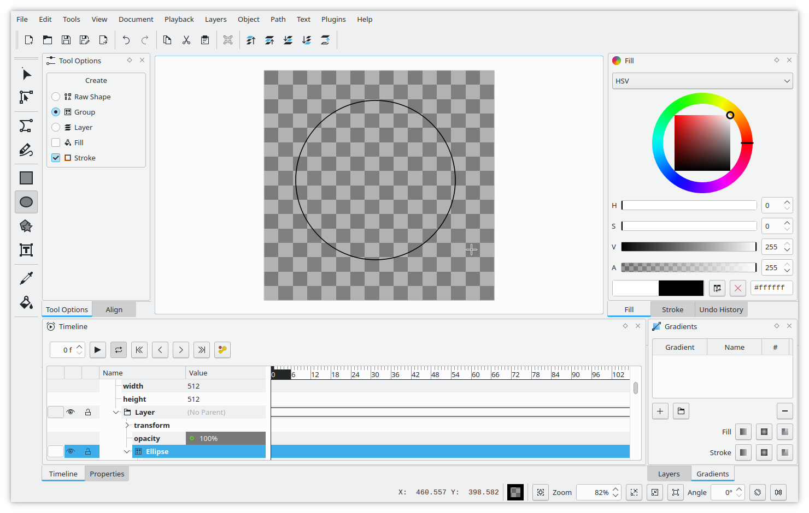
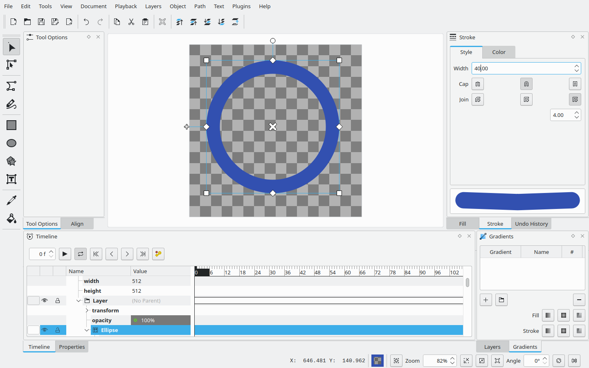
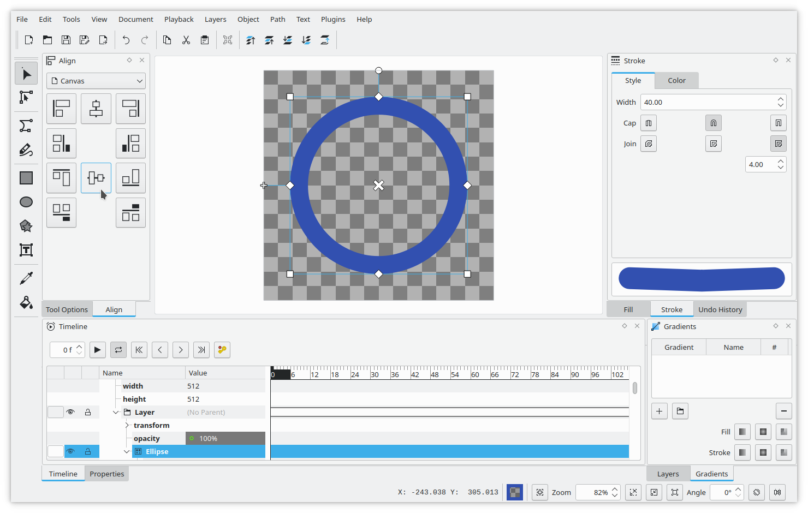
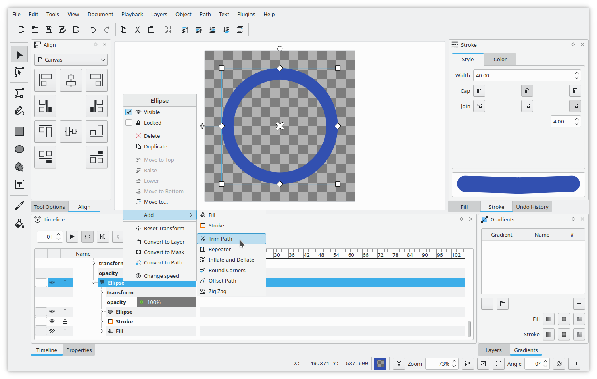
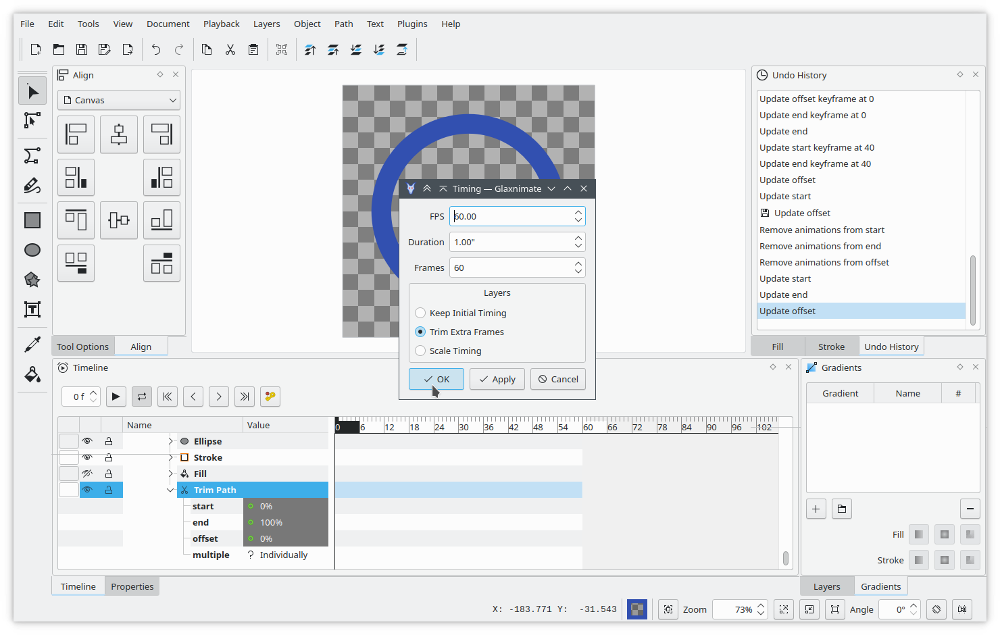
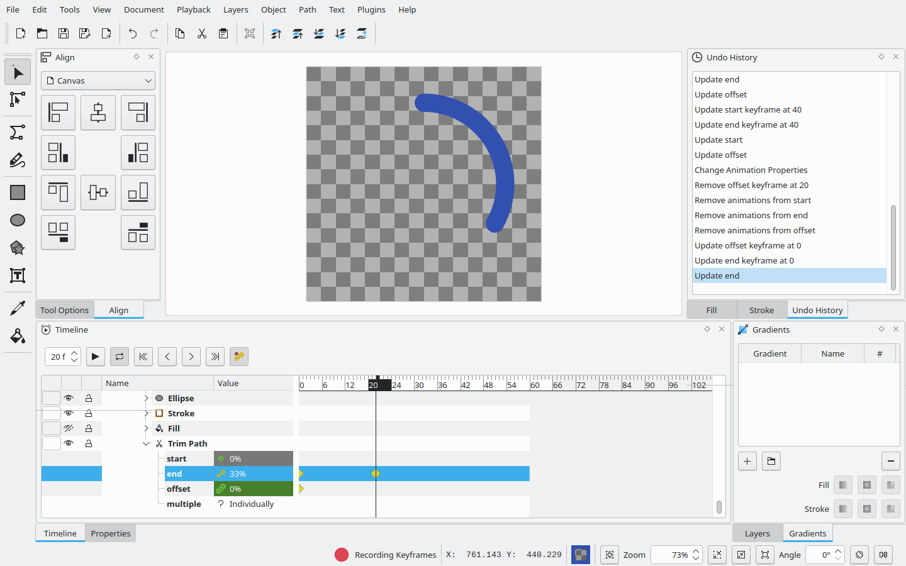
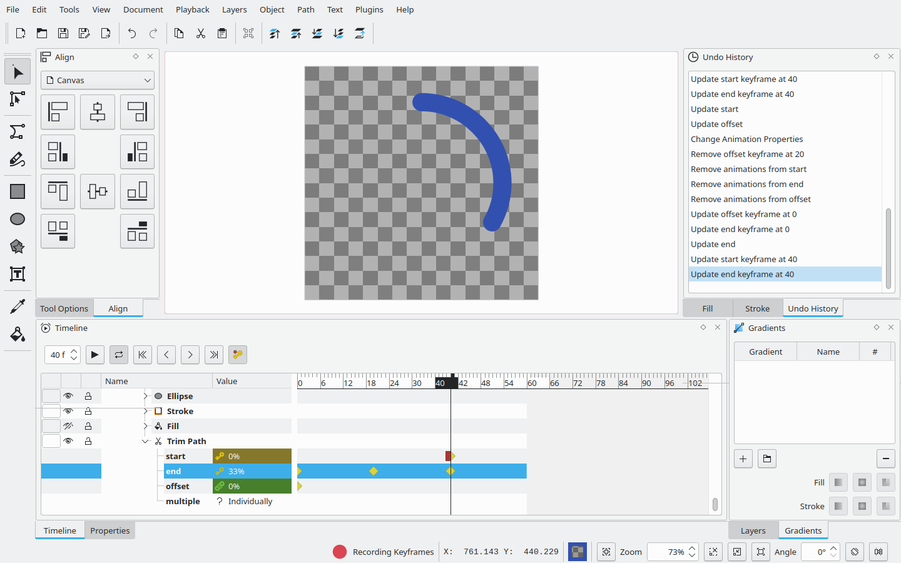
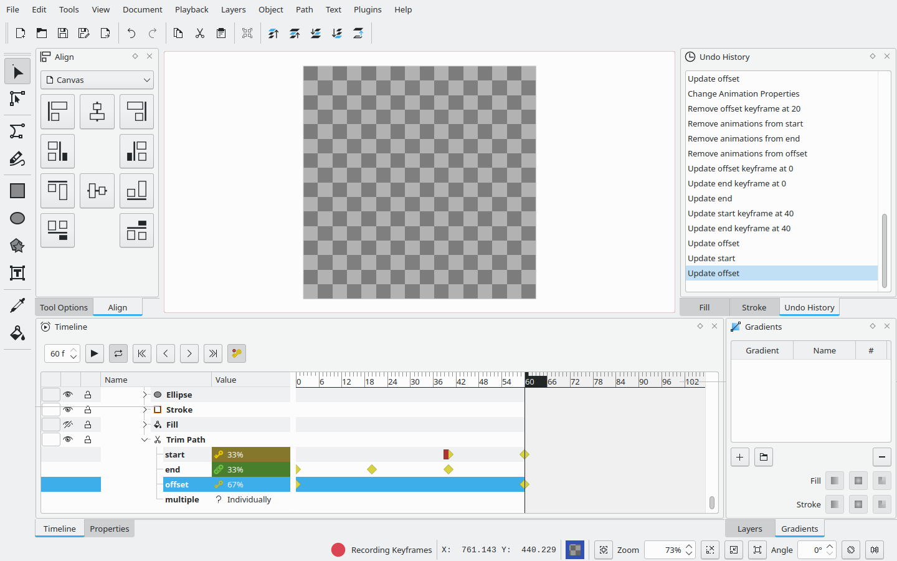

Authors: Mattia Basaglia

# Loading Spinner

This tutorial will show how to create a simple loading spinner animation.

This highlights how to use the Trim Path feature.

{lottie:loading-spinner/spinner.json:512:512:spinner.rawr}

Draw a Circle
-------------

Draw a circle for the spinner.
You can do this by selecting the "Ellipse" tool from the toolbar.
Ensure in the tool options the Fill is disabled and Stroke is enabled.
Click and drag on the canvas to create a circle of the desired size.
If you hold Ctrl, Glaxnimate will ensure the ellipse is a perfect circle.

You can change the stroke color and thickness, as well the cap style to Round.

To align the circle at the center of the canvas you can use the align view,
just make sure you select _Canvas_ from the dropdown.

Trim Path
---------

The Trim Path is a modifier that allows you to animate a shape being "drawn"
and similar effects.

We will use it to make the loading spinner appear, go around, and disappear.

To add it, you can right click on the _Ellipse_ group in the timeline,
then select _Add_ and _Trim Path_.

The animation is going to be 60 frames long, ensure you have the correct
timing from the document timing dialog.

Adding Keyframes
----------------

We will now add some keyframes on the trim path properties.

To add a keyframe ensure you have the correct frame selected, change the
property value, then right click on the property track on the timeline
and select _Add Keyframe_.

At frame 0 add a keyframe setting `end` and `offset` to 0%.
This will hide the circle as there's nothing between `start` and `end` on the trim path.

At frame 20 add a keyframe setting `end` to 33%.
This adds the first phase of the animation, a segment of the circle appearing from the top.

At frame 40 add a keyframe setting `start` to 0%.

At frame 60 add a keyframe setting `start` to 33% and `offset` to 67%.
This will make the spinner disappear in a similar fashion to how it appeared.

